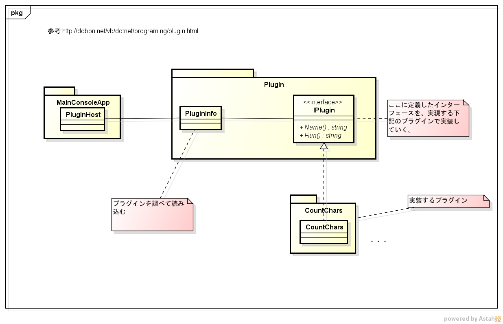
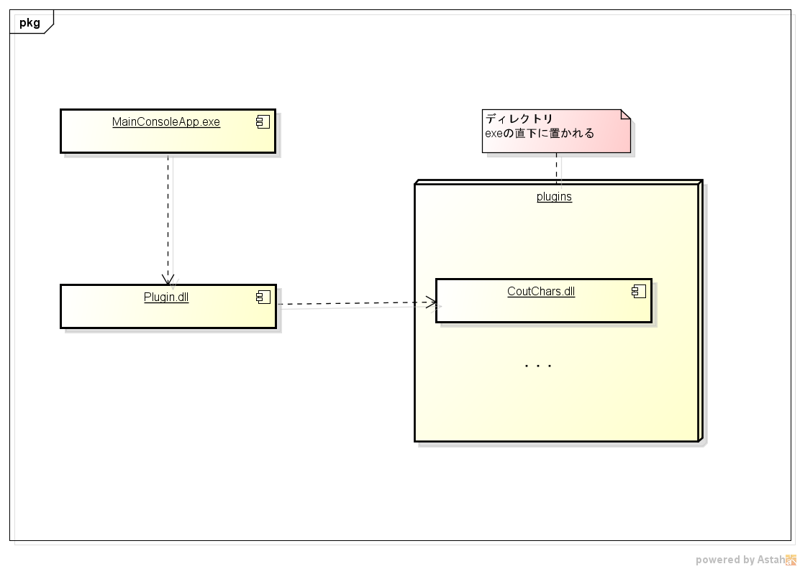
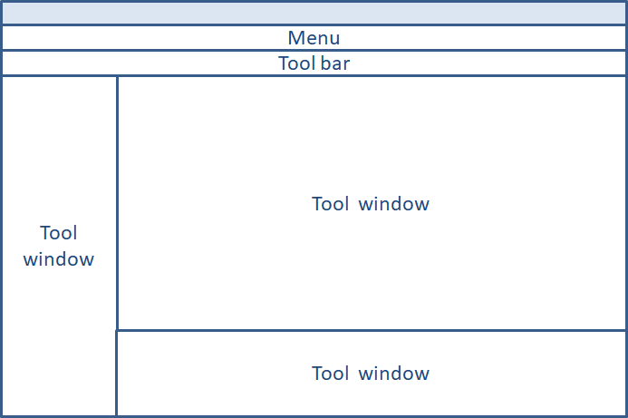

# SampleOfPluginSoftware

## 基本的な実装方法

* インターフェース(GUI、コマンド)を定義する
* インターフェースの拡張方法を定義する
* 定義したインターフェースを実装したプラグイン、ホストアプリケーションを作成する

## 基本的な利用方法

* プラグインは何がしかの実行形式ファイルにする
* ホストアプリケーションはそのファイルを特定の場所に格納して利用する

## CSharp の実装

### 実装方法

* インターフェースを定義したdllを作成する
* 定義されたインターフェースを実装したプラグインをdllで作成する
* プラグインを読み込んで利用するホストアプリケーションを作成する

### 参考記事

* http://dobon.net/vb/dotnet/programing/plugin.html

## Java の実装

* プラグイン用にインターフェースを定義する
* 定義されたインターフェースを実装したプラグインをjarで作成する
* Jarファイルには、プラグインクラス名を記したマニフェストファイルを作成する
* プラグインを読み込んで利用するホストアプリケーションを作成する

### 参考記事

* https://codezine.jp/article/detail/1271

## 個人的な所感

* C#やJavaなどで実装する場合はどういうプラグインを作るれるようにするかを含めたインターフェースの定義が必須になる
* IDEのようなものを実現したいならVisualStudioやEclipseのプラグイン開発のインターフェースを参考にすると良さそう
  * https://docs.microsoft.com/ja-jp/visualstudio/extensibility/starting-to-develop-visual-studio-extensions?view=vs-2017
  * https://gihyo.jp/dev/serial/01/eclipse-plugin/0001
* 記載していないが、Pythonなどのインターフェースが存在しない言語では多重継承を利用して実装するみたい
* デスクトップアプリの場合、VisualStudioやEclipseの例を見る限りは、基本的なGUIの構成やデザインは現状変わっていない
  * それぞれに対して拡張を定義する機構を持っている
  * メニュー/ツールバー/ツールウィンドウ
  

## 補足

### プラグイン開発者の開発手順

1. UI、コマンドなどの登録する
1. 登録された対象物のインターフェースを実装する
1. 実装したプラグインをテストする

## ToDo

* それぞれの典型的なIDEの実装サンプル(VisualStudio,Eclipse)を作成する

以上。
